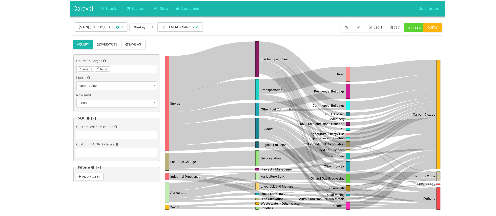

# Druid the Sales Pitch

- Sub-Second Queries
- Real-time Streams
- Scalable to Petabytes
- Deploy Anywhere
- Vibrant Community (Open Source)

<aside class="notes">
- Ideal for powering user-facing analytic applications
- Deploy anywhere: cloud, on-premise, integrate with Haddop, Spark, Kafka, Storm, Samza
</aside>

# Intro

## Experience

- Real Time Social Media Analytics

## Real Time?

- Ingestion Latency: seconds
- Query Latency: seconds

## Demand

- Twitter: `20k msg/s`, `1msg = 10ko`  during 24h
- Facebook public: 1000 to 2000 msg/s continuously
- Low Latency

## Reality

- Twitter: 400 msg/s continuously, burst to 1500
- Facebook: 1000 to 2000 msg/s

# Origin (PHP)

\  

# 1st Refactoring (Node.js)

- Ingestion still in PHP
- Node.js, Perl, Java & R for sentiment analysis
- MongoDB
- Manually made time series (Incremental Map/Reduce)
- Manually coded HyperLogLog in js

# Return of Experience

\  

# Return of Experience

- Ingestion still in PHP (600 msg/s max)
- Node.js, Perl, Java (10 msg/s max)

# 2nd Refactoring

- Haskell
- Clojure / Clojurescript
- Kafka / Zookeeper
- Mesos / Marathon
- Elasticsearch
- **Druid**

# 2nd Refactoring (FTW!)

\  

# 2nd Refactoring return of experience

- No limit, everything is scalable
- High availability
- Low latency: Ingestion & User faced querying
- Cheap if done correctly

**Thanks Druid!**

# Demo

- Low Latency High Volume of Data Analysis
- Typically `pulse`

<a href="http://pulse.vigiglo.be/#/vigiglobe/Earthquake/dashboard" target="_blank">
DEMO Time
</a>

# Pre Considerations

## Discovered vs Invented

Try to conceptualize a s.t.

- Ingest Events
- Real-Time Queries
- Scalable
- Highly Available

Analytics: timeseries, alerting system, top N, etc...

## In the End

Druid concepts are always emerging naturally

# Druid

## Who?

Metamarkets

<a href="http://druid.io/druid-powered.html"
   target="_blank">Powered by Druid</a>

- Alibaba, Cisco, Criteo, eBay, Hulu, Netflix, Paypal...

## Goal

> Druid is an open source store designed for
> real-time exploratory analytics on large data sets.

> hosted dashboard that would allow users to
> arbitrarily explore and visualize event streams.

## Concepts

- Column-oriented storage layout
- distributed, shared-nothing architecture
- advanced indexing structure

## Key Features

- Sub-second OLAP Queries
- Real-time Streaming Ingestion
- Power Analytic Applications
- Cost Effective
- High Available
- Scalable

## Right for me?

- require fast aggregations
- exploratory analytics
- analysis in real-time
- lots of data (trillions of events, petabytes of data)
- no single point of failure

# High Level Architecture

## Inspiration

- Google's [BigQuery/Dremel](http://static.googleusercontent.com/media/research.google.com/en/us/pubs/archive/36632.pdf)
- Google's [PowerDrill](http://vldb.org/pvldb/vol5/p1436_alexanderhall_vldb2012.pdf)

## Index / Immutability

Druid indexes data to create mostly immutable views.

## Storage

Store data in custom column format highly optimized for aggregation & filter.

## Specialized Nodes

- A Druid cluster is composed of various type of nodes
- Each designed to do a small set of things very well
- Nodes don't need to be deployed on individual hardware
- Many node types can be colocated in production

# Druid vs X

## Elasticsearch

- resource requirement much higher for ingestion & aggregation
- No data summarization (100x in real world data)

## Key/Value Stores (HBase/Cassandra/OpenTSDB)

- Must Pre-compute Result
    - Exponential storage
    - Hours of pre-processing time
- Use the dimensions as key (like in OpenTSDB)
    - No filter index other than range
    - Hard for complex predicates

## Spark

- Druid can be used to accelerate OLAP queries in Spark
- Druid focuses on the latencies to ingest and serve queries
- Too long for end user to arbitrarily explore data

## SQL-on-Hadoop (Impala/Drill/Spark SQL/Presto)

- Queries: more data transfer between nodes
- Data Ingestion: bottleneck by backing store
- Query Flexibility: more flexible (full joins)

# Data

## Concepts

- **Timestamp column**: query centered on time axis
- **Dimension columns**: strings (used to filter or to group)
- **Metric columns**: used for aggregations (count, sum, mean, etc...)

## Indexing

- Immutable snapshots of data
- data structure highly optimized for analytic queries
- Each column is stored separately
- Indexes data on a per shard (segment) level

## Loading

- Real-Time 
- Batch

## Querying

- JSON over HTTP
- Single Table Operations, no joins.

## Segments

- Per time interval
    - skip segments when querying
- Immutable
    - Cache friendly
    - No locking
- Versioned
    - No locking
    - Read-write concurrency

# Roll-up

## Example

~~~
timestamp             page    ... added  deleted
2011-01-01T00:01:35Z  Cthulhu     10      65
2011-01-01T00:03:63Z  Cthulhu     15      62
2011-01-01T01:04:51Z  Cthulhu     32      45
2011-01-01T01:01:00Z  Azatoth     17      87
2011-01-01T01:02:00Z  Azatoth     43      99
2011-01-01T02:03:00Z  Azatoth     12      53
~~~

~~~
timestamp             page    ... nb added deleted
2011-01-01T00:00:00Z  Cthulhu      2 25    127
2011-01-01T01:00:00Z  Cthulhu      1 32    45
2011-01-01T01:00:00Z  Azatoth      2 60    186
2011-01-01T02:00:00Z  Azatoth      1 12    53
~~~

## as SQL

~~~
GROUP BY timestamp, page, nb, added, deleted
  :: nb = COUNT(1)
  ,  added = SUM(added)
  ,  deleted = SUM(deleted)
~~~

In practice can dramatically reduce the size (up to x100)

# Segments

## Sharding

<small>`sampleData_2011-01-01T01:00:00:00Z_2011-01-01T02:00:00:00Z_v1_0`</small>

~~~
timestamp             page    ... nb added deleted
2011-01-01T01:00:00Z  Cthulhu      1 20    45
2011-01-01T01:00:00Z  Azatoth      1 30    106
~~~

<small>`sampleData_2011-01-01T01:00:00:00Z_2011-01-01T02:00:00:00Z_v1_0`</small>

~~~
timestamp             page    ... nb added deleted
2011-01-01T01:00:00Z  Cthulhu      1 12    45
2011-01-01T01:00:00Z  Azatoth      2 30    80
~~~

## Core Data Structure

\  

- dictionary
- a bitmap for each value
- a list of the columns values encoded using the dictionary

## Example

~~~
dictionary: { "Cthulhu": 0
            , "Azatoth": 1 }

column data: [0, 0, 1, 1]

bitmaps (one for each value of the column):
value="Cthulhu": [1,1,0,0]
value="Azatoth": [0,0,1,1]
~~~

## Example (multiple matches)

~~~
dictionary: { "Cthulhu": 0
            , "Azatoth": 1 }

column data: [0, [0,1], 1, 1]

bitmaps (one for each value of the column):
value="Cthulhu": [1,1,0,0]
value="Azatoth": [0,1,1,1]
~~~

  
## Real-time ingestion

- Via Real-Time Node and Firehose
    - No redundancy or HA, thus not recommended
- Via Indexing Service and Tranquility API
    - Core API
    - Integration with Streaming Frameworks
    - HTTP Server
    - **Kafka Consumer**

## Batch Ingestion

- File based (HDFS, S3, ...)

## Real-time Ingestion

~~~
Task 1: [   Interval          ][ Window ]
Task 2:                        [                     ]
----------------------------------------------------->
                                                  time
~~~

# Querying

## Query types

- Group by: group by multiple dimensions
- Top N: like grouping by a single dimension
- Timeseries: without grouping over dimensions
- Search: Dimensions lookup
- Time Boundary: Find available data timeframe
- Metadata queries

## Example(s)

~~~
{"queryType": "groupBy",
 "dataSource": "druidtest",
 "granularity": "all",
 "dimensions": [],
 "aggregations": [
     {"type": "count", "name": "rows"},
     {"type": "longSum", "name": "imps", "fieldName": "impressions"},
     {"type": "doubleSum", "name": "wp", "fieldName": "wp"}
 ],
 "intervals": ["2010-01-01T00:00/2020-01-01T00"]}
~~~

## Result

~~~
[ {
  "version" : "v1",
  "timestamp" : "2010-01-01T00:00:00.000Z",
  "event" : {
    "imps" : 5,
    "wp" : 15000.0,
    "rows" : 5
  }
} ]
~~~

## Caching

- Historical node level
    - By segment
- Broker Level
    - By segment and query
    - `groupBy` is disabled on purpose!
- By default: local caching

# Druid Components

## Druid

- Real-time Nodes
- Historical Nodes
- Broker Nodes
- Coordinator
- For indexing:
    - Overlord
    - Middle Manager

## Also

- Deep Storage (S3, HDFS, ...)
- Metadata Storage (SQL)
- Load Balancer
- Cache

## Coordinator

- Real-time Nodes (pull data, index it)
- Historical Nodes (keep old segments)
- Broker Nodes (route queries to RT & Hist. nodes, merge)
- Coordinator (manage segemnts)
- For indexing:
    - Overlord (distribute task to the middle manager)
    - Middle Manager (execute tasks via Peons)

# When *not* to choose Druid

- Data is not time-series
- Cardinality is _very_ high
- Number of dimensions is high
- Setup cost must be avoided

# Graphite (metrics)

\__

[Graphite](http://graphite.wikidot.com)

# Pivot (exploring data)

\  

[Pivot](https://github.com/implydata/pivot)

# Caravel

\  

[Caravel](https://github.com/airbnb/caravel)

# Conclusions

## Precompute your time series?

\  

## Don't reinvent it

- need a user facing API
- need time series on many dimensions
- need real-time
- big volume of data

## Druid way is the right way!

1. Push in kafka
2. Add the right dimensions
3. Push in druid
4. ???
5. Profit!
